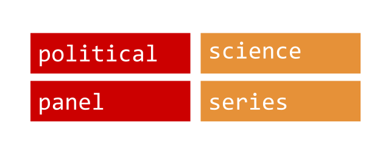

Guidelines for psData and Associated Data Gathering Packages
===

**psData** is an approach to gathering, cleaning, and merging *P*olitical *S*cience, *P*anel-*S*eries data. The approach will be implemented with the [psData](https://github.com/rOpenGov/psData) [R](http://www.r-project.org/) package and associated packages. 

# Very early, feel free to edit/suggest changes #

## Metadata 

`psData` objects have the following metadata:

- `panel` 

- `format` (format of the panel ID)

- `time`

- `date` (time format)

## Main methods

1. `get_data`: calls functions from associated data *getter* and *variable builder* packages packages to download and build a single data frame. 

  - Arguments/capabilities: `source` the data getter/builder package to call. `vars`: labels of specific variables to gather. `...` arguments to pass to the getter/builder function. `sha1` an sha1 hash to uniquely identify data sets. This could include specific URLs, or information idiosyncratic to a particular data set. 
  
  - Need to standardise how the data should look when it is returned from the getters/builders.

2. `panel_set`: cleans the panel-series data gathered by `get_data` and standardises it into a `psData` object. 

  - Arguments/capabilities: needs arguments to set the panel and series formats. Needs arguments to specify how to deal with 'tricky panels', e.g. East/West Germany.
  
3. `ps_merge`: merges `psData` objects into a single object. 

  - Arguments/capabilities: break if panel-series do not match. Arguments allowing the user to specify if all observations or just from one object are to be kept. Allow user to merge more than one object? 

## Assocaited data gathering packages

FILL IN LIST

### Further transformations

Transformations of `psData` beyond basic merging, such as creating dyadic data, lags, leads, plotting, and so on will be handled by a further package(s). A separate guideline document should be created to established a consistent framework.

## Style guide

### Naming

- Package names/object classes: modified camelCase where the first word is lower case and following words begin with a capital letter. Words are not separated. For example: 'psData'.

- Methods, function names, and arguments: all lowercase, with words separated by an underscore `_`. For example: 'get_data'. 

- Object names in documentation and object names internal to the functions: all lowercase, with words separated by periods. For example, 'qog.data'.